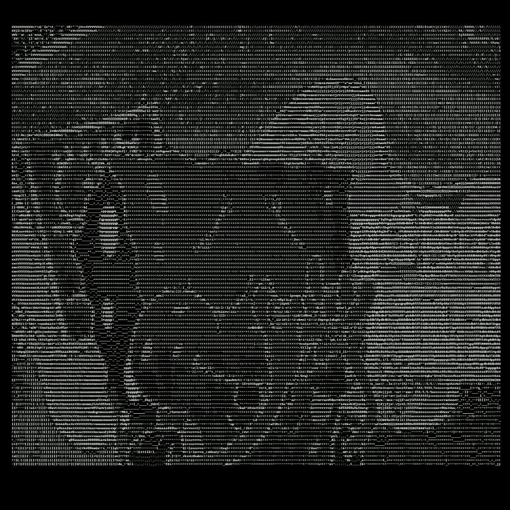

# textVideo
- this is a simple text video programme
- it can change your picture/video into txt format
- this programme is powered by python3

## how to play?
- download the code and place your picture/video in the same folder
- open the terminate window
- type `python pixel_video.py YOUR_VIDEO.mp4` then it will start to run
- change the `YOUR_VIDEO` to your oringinal video name, it has to be in mp4, better to be in 1080*1920

## what's more?
- beside vedio, you can also try converting a picture into txt
- just type `python img_txt.py YOUR_PICTURE.jpg` in terminal window

